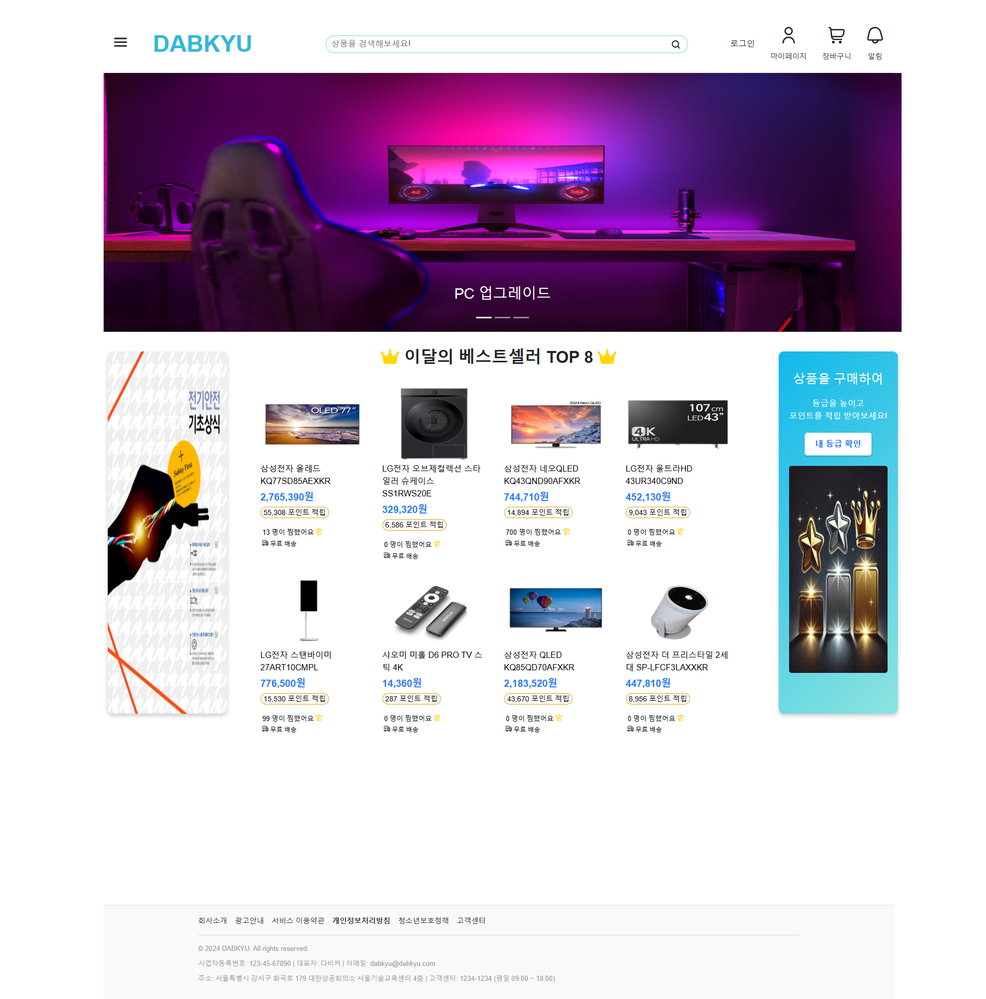
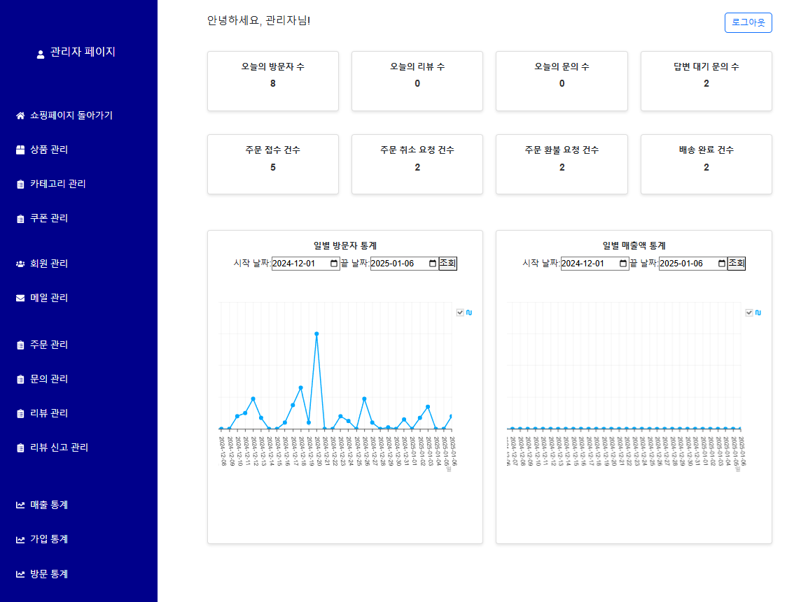
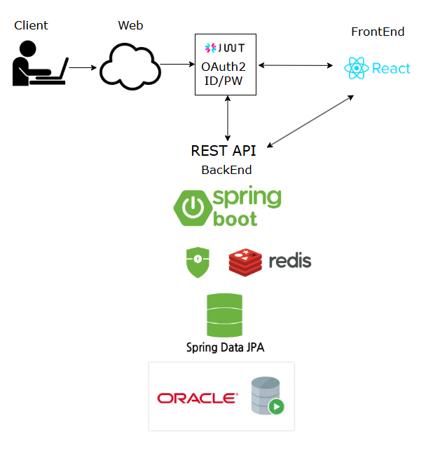
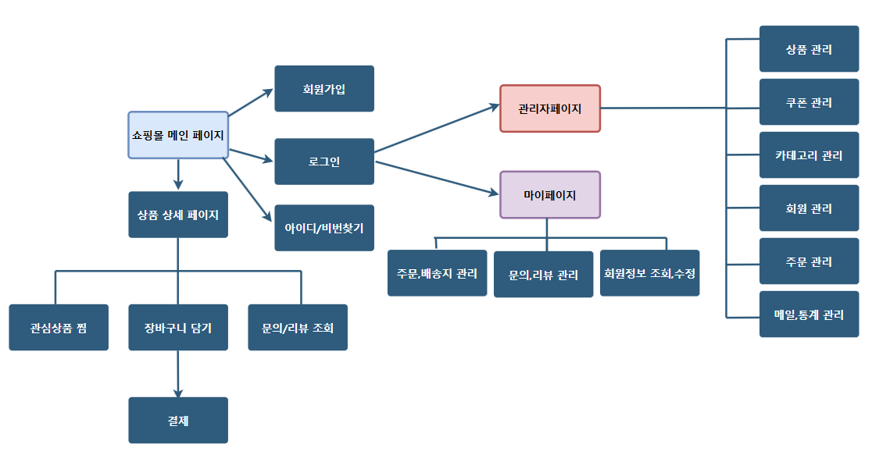

# DaBKyu

  

 

# DaBKyu Web Site v1.0
> 대한상공회의소 서울기술교육센터  
> 개발기간 : 2024.10 - 2024.12
## 웹 개발팀 소개🙌🏻

|   이름  | 역할 | GitHub Link |
|:--------|:------------|:-----|
|  구나영  | 백 엔드     |https://github.com/nayoung99|
|  박동현  | 프론트 엔드 ||
|  배정수  | 프론트 엔드 |https://github.com/qowjdtn713|
|  이고은  | 백 엔드     ||
|  장준호  | 프론트 엔드 ||
|  하성범  | 백 엔드     |https://github.com/EnochSB|
---
## 프로젝트 소개📖
**DaBKyu는 사용자의 편리함과 니즈에 맞춘 전자제품 구매 플랫폼입니다.**

각 회원마다 최적화된 맞춤형 서비스를 통해 쇼핑의 즐거움을 극대화 시키고,
 
개인화된 사용자 경험을 통해 고객 충성도 및 사이트 재방문율 향상을 목표로 두었습니다.

**기존에 존재하던 다양한 웹 쇼핑몰 사이트들의 불편함을 해결**
1. 전자제품에 대한 전문적인 검색이 가능
2. 유저 맞춤 기능 및 사용자 친화적 UX/UI 구성
3. 과다 광고로 인한 신뢰도 감소 및 제품 품질 판단에 대한 어려움 개선

## ⚙️Skills
<h3 style="margin-top:0px">Platforms & Languages</h3>

<!--  -->

 
<h3 style="margin-top:0px">Tools</h3>

## UI 구성

<h3>메인 페이지</h3>
  

<h3>관리자 페이지</h3>
  

## 주요 기능🔎
<h3>⭐사용자에 따라 맞춤 제공되는 추천 상품</h3>

- 비로그인 상태에서는 전체 판매량 중 top8개의 상품을 추천
- 로그인 상태에서는 회원의 성별, 연령대의 판매량 중 top8개의 상품을 추천

<h3>⭐카테고리 정밀 세분화 및 검색 가능</h3>

 - 찾고자 하는 상품의 카테고리를 세밀하게 선택이 가능하며, 카테고리 내 검색 기능을 통해
  
 더욱 빠른 탐색이 가능
 
 <h3>⭐관리자의 편의성 향상</h3>

- 직관적인 디자인과 단순한 구조로 관리자의 웹사이트 운영 편의성을 향상

## 시스템 구성도 & 사이트맵

<h3>시스템 구성도</h3>
  

<h3>사이트맵</h3>
  

